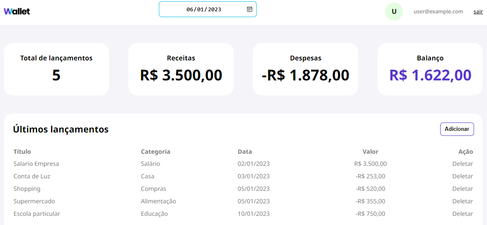

<h1 align="center">👛 Wallet App Front-end</h1>

<p align="center">
  This is an finances management dashboard made with JavaScript, HTML and CSS.
  The main objective is the user add and delete finances releases (that are saved in the api), and inform him the balance of the month.
</p>

<br>

<p align="center">
  
</p>

## 🖵 Live application

https://andreport.github.io/wallet-app-frontend/

## 🚀 Technologies

- JavaScript
- HTML
- CSS

## 💻 Instructions to run

1. Clone the application:

```
git clone https://andreport.github.io/wallet-app-frontend/.git
```

2. Open in the explorer the project and open the index.html file

```
Open the index.html file with some browser
```

3. You can create your own user or use the test user:

```
user@example.com
```
